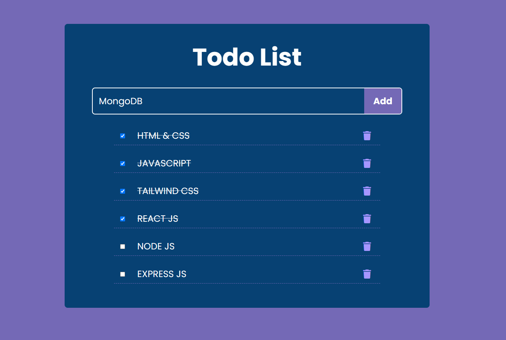

# [Todo List Project](https://todo-list-vinaykollikani.netlify.app/)

Welcome to the Todo List Project! This project is a simple and efficient todo list application developed using modern
web technologies. The main purpose of this project is to help users keep track of their tasks and manage their time
effectively.

## Technologies Used

- **HTML & CSS**
- **JavaScript**
- **React JS**
- **Tailwind CSS**
- **Vite**

## Features

- **Add Tasks**: Easily add new tasks to your todo list.
- **Delete Tasks**: Remove tasks that are no longer needed.
- **Mark Tasks as Completed**: Keep track of completed tasks.
- **Responsive Design**: The application is fully responsive and works on all device sizes.

## Screenshot

=======

>>>>>>> bcc6244b6a41552e278a3ad4fc0128cf739b6f87

## Installation

To get started with this project, follow these steps:

1. **Clone the repository:**

   ```sh
   git clone https://github.com/your-username/todo-list.git
   ```

2. **Navigate to the project directory:**

   ```sh
   cd todo-list
   ```

3. **Install the dependencies:**

   ```sh
   npm install
   ```

4. **Run the application:**
   ```sh
   npm run dev
   ```

## Usage

Once the application is running, you can start adding tasks using the input field. Tasks will be displayed in a list
format, and you can interact with them using the provided buttons to edit, delete, or mark them as completed.

## Project Structure

```
todo-list/
├── src/
│   ├── components/
│   │   ├── Todomain.jsx
│   │   └── TodoItem.jsx
│   ├── App.jsx
│   ├── index.css
│   ├── main.jsx
│   └── ...
├── .gitignore
├── index.html
├── package.json
├── postcss.config.js
├── tailwind.config.js
├── vite.config.js
└── README.md
```

## Contributing

Contributions are welcome! If you have any suggestions or improvements, please create an issue or submit a pull request.

1. Fork the repository.
2. Create a new branch.
3. Make your changes.
4. Submit a pull request.

---

Thank you for checking out this Todo List Project! If you have any questions or feedback, feel free to reach out.

Happy Coding!
